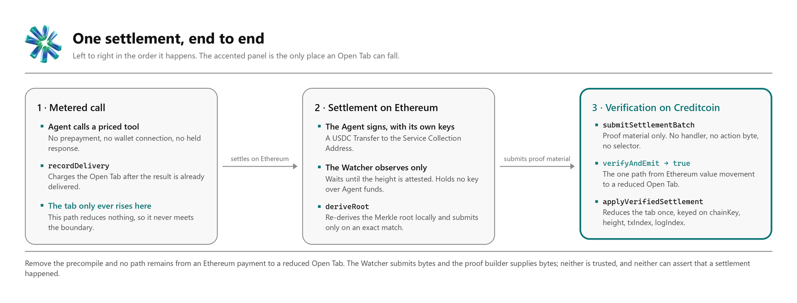
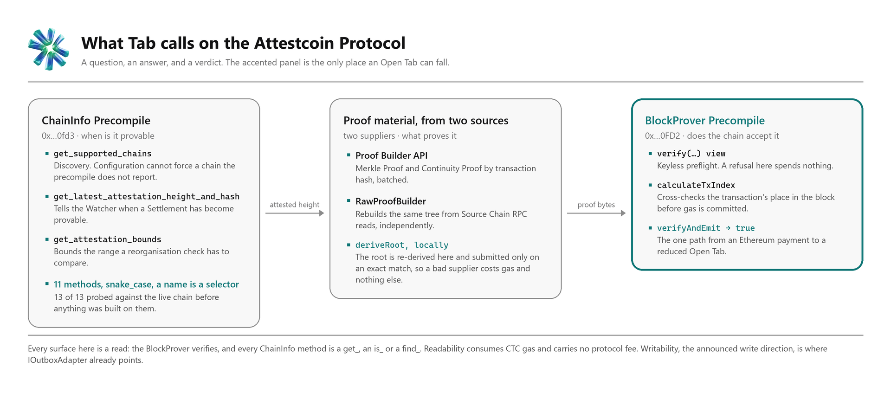
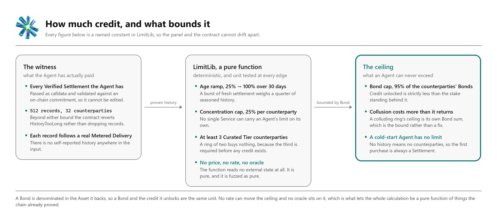
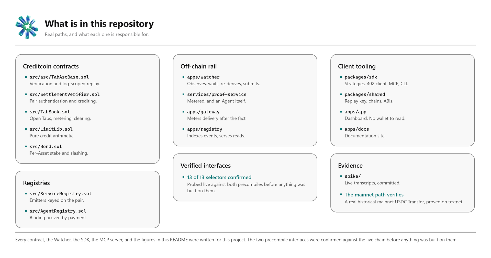
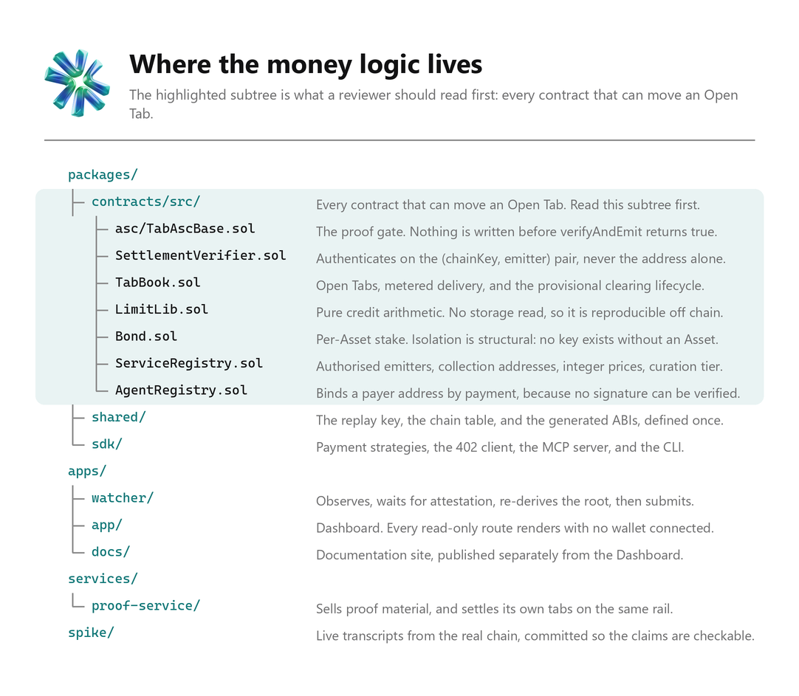

<p align="center">
  <picture>
    <source media="(prefers-color-scheme: dark)" srcset="./assets/readme/hero-dark.png">
    <source media="(prefers-color-scheme: light)" srcset="./assets/readme/hero-light.png">
    
  </picture>
</p>

<p align="center">
  <a href="https://creditcoin.org"></a>
  <a href="https://attestcoin.org"></a>
  
  
  <a href="./LICENSE"></a>
  <a href="https://www.npmjs.com/package/@tabai/sdk"></a>
  
</p>

# Tab

**Agents buy first and pay later, and nobody is trusted to say the money arrived.**

A Service meters usage into an Open Tab held on Creditcoin.
The Agent settles that Tab in USDC on Ethereum, with its own keys, whenever it likes.
A Creditcoin contract then verifies that Ethereum transaction itself through the [Attestcoin Protocol](https://attestcoin.org)'s BlockProver Precompile.

No facilitator, no oracle, no bridge, and no API key sits between the payment and the ledger entry.
The chain checks the payment.

Built by **Emad Qureshi** for the BUIDL CTC 2026 Fall hackathon. MIT licensed.
Live on Creditcoin CC3 Testnet / built for Creditcoin Mainnet.

---

## Links

| | |
| --- | --- |
| **Live Dashboard** | *deploying* <!-- TODO(link): production Dashboard URL --> |
| **Documentation site** | *deploying* <!-- TODO(link): production docs URL --> |
| **Whitepaper** | [`WHITEPAPER.md`](./WHITEPAPER.md) |
| **Pitch deck** | *in progress* <!-- TODO(link): deck PDF --> |
| **Demo video** | *recording* <!-- TODO(link): demo video --> |
| **npm package** | [`@tabai/sdk`](https://www.npmjs.com/package/@tabai/sdk) - published |
| **Deployed contracts** | [on Blockscout](#deployed-on-chain), and in [`deployments.json`](./deployments.json) |
| **Attestcoin Protocol** | [attestcoin.org](https://attestcoin.org) · [docs](https://docs.attestcoin.org) · [ASC Dashboard](https://dashboard.cc3-testnet.creditcoin.network) |

---

## The problem

An autonomous agent cannot open a bank account, cannot hold a card, and cannot sign a contract.
So every way it currently pays for a service is a prepayment: a funded wallet, a held response, an API key bought by a human in advance.
That is not billing, it is a deposit, and it puts a person back in the loop of an autonomous system.

Post-paid billing needs credit, credit needs a repayment record, and a repayment record needs somebody to confirm the repayments.
Until now that somebody has been a facilitator, an oracle, or a bridge - a party you have to trust to say that money moved on another chain.

The Attestcoin Protocol removes that party.
Creditcoin attests to finalized Source Chain blocks, so a Creditcoin contract can verify an Ethereum transaction, its receipt, and its event logs for itself.
Tab is what you build once that is possible: **a credit facility whose entire repayment history is proved rather than asserted.**

---

## How one settlement works



1. **The Agent calls a priced tool.** No prepayment, no wallet connection, no held response. The Service does the work, returns the result, and *then* records the charge with `recordDelivery`. This path only ever raises a tab.
2. **The Agent settles on Ethereum, with its own keys.** A USDC transfer to the Collection Address the Service registered on chain. Nothing is escrowed and nobody's permission is needed.
3. **The Watcher observes and waits.** It reads the log, waits until Creditcoin has attested to the block, fetches a Merkle Proof and a Continuity Proof, and re-derives the Merkle root locally before it will submit anything.
4. **A Creditcoin contract verifies it.** `verifyAndEmit` on the BlockProver Precompile checks the proof against the attestation. Only if it returns `true` does the Open Tab fall.

### The removal test

Take the precompile away and no path remains from an Ethereum payment to a reduced Open Tab.

The Watcher submits bytes and the proof builder supplies bytes.
Neither is trusted, and neither can assert that a settlement happened.
What would be left is an off-chain operator signing a claim that funds landed, which is a trusted facilitator - the exact assumption Tab exists to remove.

**Tab does not degrade without the protocol. It inverts into the product it replaces.**

---

## Attestcoin Protocol integration



| Surface | Address / source | What Tab calls | What breaks without it |
| --- | --- | --- | --- |
| **BlockProver Precompile** | `0x…0FD2` | `verifyAndEmit`, `calculateTxIndex`, and the `view` overload `verify` as a keyless preflight | no Open Tab can ever be reduced by a proof, and reduction becomes an operator assertion |
| **ChainInfo Precompile** | `0x…0fd3` | 11 methods, including `get_supported_chains`, `get_latest_attestation_height_and_hash`, `get_attestation_bounds` and `get_attestation_genesis_height` | the Watcher cannot know when a Settlement is provable and has to guess finality |
| **`EvmV1Decoder`** | `@gluwa/usc-contracts` 0.1.2, linked into `SettlementVerifier` | `getTransactionType`, `decodeReceiptFields`, `getLogsByEventSignature`, `decodeCommonTxFields` | the verified bytes cannot be read as a receipt, so no log can be authenticated |
| **Proof Builder API** | [`prover.cc3-testnet…`](https://prover.cc3-testnet.creditcoin.network) | proof pairs by transaction hash, and batched | proof material has to be rebuilt locally, which is what the fallback below does |
| **RawProofBuilder** | `@gluwa/usc-sdk` 0.18.0 | rebuilds the block's transaction tree and digest chain from Source Chain RPC | a single proof source becomes a single point of trust |
| **ASC Dashboard** | [`dashboard.cc3-testnet…`](https://dashboard.cc3-testnet.creditcoin.network) | read by people, never by code | nothing; it is the human view of attestation liveness |

**13 of 13 selectors were probed against the live chain before anything was built on them.**

### Nine things measured on the live network, not assumed

Each of these corrected or confirmed a claim the design made, and several of them were bugs waiting to happen.

| Finding | Why it mattered |
| --- | --- |
| The payer is the log's `topics[1]`, never the transaction `from` field | On the recorded Mainnet transaction those are two different addresses, and resolving from `from` would have credited the recipient of the money |
| One Continuity Proof proves exactly one height | A proof built to span ten heights verified the lowest and reverted `Merkle root mismatch` for the rest. Every batch member now carries its own |
| Ten sequential proofs cost 557,718 gas | 0.74 % of one 75,000,000 block, which is what makes batching worth doing |
| The precompile **reverts** rather than returning `false` | `Error("Merkle proof validation failed")`. The Watcher keys its retry decision on the decoded revert message |
| The Merkle tree is domain-separated | Leaf `0x00‖bytes`, inner `0x01‖left‖right`. The design's pseudocode omitted the tags and derived a completely different root |
| ChainInfo names are `snake_case`, and a name is a selector | Every `camelCase` guess reverts `Unknown selector` |
| The attested digest is `keccak256(height ‖ merkleRoot ‖ prevDigest)`, not the block hash | So a reorganisation check **cannot** be a digest lookup. It compares Source Chain block hashes instead |
| Attestations land on a stride of 10, checkpoints on 100 | Proof material perishes: the same Mainnet height needed a 1-root proof when fresh and 31 roots later. Proofs are fetched close to submission |
| `is_height_attested` disagreed at the frontier | Creditcoin `latest` runs ahead of `finalized`. Every readiness read is now pinned to one block tag |

Full evidence, with every transaction hash, is in [`apps/docs/content/docs/attestcoin-integration.mdx`](./apps/docs/content/docs/attestcoin-integration.mdx) and the committed transcripts under [`spike/`](./spike).

### CTC, and what it pays for

Creditcoin gas is paid in CTC on every write Tab makes: every `recordDelivery`, every clearing, and every proof submission.
Readability, the Attestcoin capability that lets a Creditcoin contract verify Source Chain transaction history, carries gas cost and no protocol fee.
Tab's protocol consumption is therefore denominated entirely in CTC.

There is no price feed, no rate, and no oracle anywhere in the system.
A Bond is denominated in the same Asset as the credit it unlocks, which is what keeps that true.

---

## Credit, and what bounds it



A Credit Limit is a pure function of Verified Settlements the chain already proved.
`LimitLib` reads no external state at all - it is fuzzed as a pure function, and every constant in the figure above is a named constant in the contract.

A cold-start Agent therefore has **no** credit, and that is the rule rather than a fault: with no settlement history it has no counterparties, so its first purchase must be a Settlement.
That first Settlement banks prepaid credit and creates the history a limit is computed from.

---

## Deployed on chain

Everything below was read back off the chain by [`script/07_VerifyDeployment.s.sol`](./packages/contracts/script/07_VerifyDeployment.s.sol), which holds no key and sends nothing, so this table is checkable by anyone with an RPC endpoint rather than only by whoever deployed it.

### Creditcoin CC3 Testnet - chain id `102031`

| Contract | Address | |
| --- | --- | --- |
| `SettlementVerifier` | `0xDf4e7F76e5821ab351877C7862117fDdbC7a44a7` | [Blockscout](https://creditcoin-testnet.blockscout.com/address/0xDf4e7F76e5821ab351877C7862117fDdbC7a44a7) |
| `TabBook` | `0x047ECFB428FE706eA391B626872Ce8Deb8756c5f` | [Blockscout](https://creditcoin-testnet.blockscout.com/address/0x047ECFB428FE706eA391B626872Ce8Deb8756c5f) |
| `Bond` | `0xDbB6C19A4236ACdd8535E993C5fA93E6Ff1f173A` | [Blockscout](https://creditcoin-testnet.blockscout.com/address/0xDbB6C19A4236ACdd8535E993C5fA93E6Ff1f173A) |
| `AgentRegistry` | `0x4721f24974be89287F5C34aeE4D15D20389A2a8B` | [Blockscout](https://creditcoin-testnet.blockscout.com/address/0x4721f24974be89287F5C34aeE4D15D20389A2a8B) |
| `ServiceRegistry` | `0xF6Bb0d068698e504e2F21ca61c48167634a1fcAC` | [Blockscout](https://creditcoin-testnet.blockscout.com/address/0xF6Bb0d068698e504e2F21ca61c48167634a1fcAC) |
| `CurationMultisig` | `0x9fCe693cD68307a2450aB57f4654653643F01Bb6` | [Blockscout](https://creditcoin-testnet.blockscout.com/address/0x9fCe693cD68307a2450aB57f4654653643F01Bb6) |
| `EvmV1Decoder` | `0x10619F16E1ac73AAe41AA4C1619f1387687EED79` | [Blockscout](https://creditcoin-testnet.blockscout.com/address/0x10619F16E1ac73AAe41AA4C1619f1387687EED79) |

`LimitLib` is a pure library, linked at compile time, and holds no address of its own.

### Ethereum Sepolia - the only Source Chain contract Tab deploys

| Contract | Address | |
| --- | --- | --- |
| `TabSettlement` | `0x10619F16E1ac73AAe41AA4C1619f1387687EED79` | [Etherscan](https://sepolia.etherscan.io/address/0x10619F16E1ac73AAe41AA4C1619f1387687EED79) |

No owner, no admin, no upgrade path, no balances, no tab state.
On Ethereum Mainnet Tab deploys **nothing at all**: a plain USDC transfer to a registered Collection Address is the Settlement, and Creditcoin reads it.

### Precompiles, collections and roles

| | Address | |
| --- | --- | --- |
| BlockProver Precompile | `0x0000000000000000000000000000000000000FD2` | native, reports zero code bytes |
| ChainInfo Precompile | `0x0000000000000000000000000000000000000fd3` | native, `snake_case` selectors |
| Tab Collection Address | `0x952AcC70E6f54Ce87Dca963193A5957BCb27729e` | [Blockscout](https://creditcoin-testnet.blockscout.com/address/0x952AcC70E6f54Ce87Dca963193A5957BCb27729e) |
| Bond Collection Address | `0x9D6Ad64AE2D000873FFdfC757808F24cF9Cf67FC` | [Blockscout](https://creditcoin-testnet.blockscout.com/address/0x9D6Ad64AE2D000873FFdfC757808F24cF9Cf67FC) |
| Curation authority | `0x621663045265405B65d2afD1c22bC7254f8E1dec` | the one privileged role, [described below](#the-one-privileged-role) |
| Watcher | `0xb67c73fd513adF5d270d1102F04eb8327F218FE7` | may clear provisionally; cannot mint credit |

Source chains are Ethereum Sepolia as `chainKey 1` and Ethereum Mainnet as `chainKey 3`.

---

## Run it

### Prerequisites

Node `>= 20.10.0`, pnpm `9.15.3` (pinned through `packageManager`, never npm), and [Foundry](https://getfoundry.sh) for the Solidity work.

### In three commands, keylessly

```bash
pnpm install
pnpm env:bootstrap        # writes .env from .env.example plus the recorded addresses
pnpm tab:verify           # reads the live deployment. No key, no funded account, no write
```

`tab:verify` removes every secret-shaped variable from its own environment before the first chain read and prints which ones it removed, so keylessness is a property of the run rather than a claim about it.

### The Dashboard, locally

```bash
pnpm --filter @tabai/app build:site
pnpm --filter @tabai/app serve            # http://localhost:3000
pnpm --filter @tabai/docs dev             # http://localhost:3001
```

Every read-only route works with no wallet: browse Services and their prices, look up any Agent's Open Tab and Credit Limit, and open any Verified Settlement in the explorer by its replay key.
Connecting a wallet is only ever asked for when you are about to spend.

### The worked demo: two agents trading end to end

```bash
pnpm build
node --env-file=.env examples/agent-demo/dist/main.js --act all
```

A stage check and four acts, against the deployed contracts on CC3 Testnet and Ethereum Sepolia.
Nothing is mocked: the tabs are real tabs and the settlements are real USDC.

| Act | What it proves |
| --- | --- |
| `stage` | Reads every precondition the other acts depend on and names each one that is not met. Writes nothing, needs no key |
| `authorise` | An Agent sets its own spending ceiling. Only the Agent can |
| `consume` | Both Agents buy, and pay for none of it. The result is returned before the charge is recorded |
| `settle` | Each Agent pays its own tab with its own key, and the Watcher proves it |
| `smart-account` | A smart account settles on one Agent's behalf while a *different* wallet sends the transaction. Credit lands on `topics[1]` and nowhere else |

**It is read-only by default.** Every act reads, simulates what it would submit, and spends nothing until you add `--broadcast`.
A refused `recordDelivery` costs real CTC and returns the same revert data a free `eth_call` returns, so paying for it first would be paying for information already available.

### From the SDK and CLI

One line puts an agent on the rail.

```bash
npx -y @tabai/sdk connect      # merges an `mcpServers.tab` entry into your MCP client's config
npx -y @tabai/sdk doctor       # checks the whole installation against the live deployment, keylessly
```

`connect` finds your client's configuration file, backs it up, merges one entry, and prints the diff before it writes.
Run it twice and the second run writes nothing.
**It never writes a private key.**

| Command | What it does | Spends |
| --- | --- | --- |
| `connect` | Writes the `tab` entry into your MCP client's configuration | nothing |
| `mcp` | Serves the four tools over MCP. This is what a client launches | nothing |
| `doctor` | Checks the installation against the live deployment | nothing, and needs no key |
| `status` | What an Agent owes, may still spend, and has settled | nothing, and needs no key |
| `settle` | Pays down an Open Tab | real funds, and only with `--broadcast` |

The four MCP tools an agent actually sees:

| Tool | What it does | Spends |
| --- | --- | --- |
| `tab_discover` | Lists Services, accepted Assets, tool prices, and each Service's Bond | nothing, and needs no key |
| `tab_call` | Calls a metered tool. The charge lands on the Open Tab and is settled later | nothing at call time |
| `tab_status` | Credit Limit, Open Tab, prepaid credit and headroom, per Asset | nothing, and needs no key |
| `tab_settle` | Pays down an Open Tab by broadcasting a Settlement with the Agent's own key | real funds |

**None of them throws.** A failure returns `ok: false` with a `category`, a `code` and a `message`, so a model can decide what to do next rather than parse an exception.

As a library:

```bash
npm install @tabai/sdk
```

```ts
import { settlementReplayKey, createTabToolset } from "@tabai/sdk";

// The four coordinates that identify a Verified Settlement, packed.
const key = settlementReplayKey({
  chainKey: 1n,
  blockHeight: 11649148n,
  txIndex: 93n,
  logIndex: 0n,
});
```

The package ships its own types and carries no workspace dependency, so it installs and type-checks on its own.
Full integration guide: [`integration.mdx`](./apps/docs/content/docs/integration.mdx).

---

## What is in this repository



Every contract, the Watcher, the SDK, the MCP server, and every figure in this README was written for this project.



Dependency direction is linted, in this direction only: apps, services and examples depend on packages; the SDK depends on shared; shared depends on nothing.

---

## The one privileged role

A curation authority decides which Services hold the Curated Tier, and so which Settlement history carries Credit Limit weight.
It has no power over metering, over any tab, or over any Bond.

Two things bound it.
Every change it makes is queued and held for **48 hours** behind a public `RegistryChangeQueued` event before it can apply, so a promotion is contestable before it takes effect and you can watch the countdown on the Service directory.
And the role cannot move: `ServiceRegistry` takes its authority as a constructor argument and exposes no setter, so it can only change at a deployment, by this project or by anyone.

The role is held by `0x621663045265405B65d2afD1c22bC7254f8E1dec`, an account this project controls.
A 2-of-3 [`CurationMultisig`](./packages/contracts/src/CurationMultisig.sol) is deployed at [`0x9fCe693cD68307a2450aB57f4654653643F01Bb6`](https://creditcoin-testnet.blockscout.com/address/0x9fCe693cD68307a2450aB57f4654653643F01Bb6) and takes the role at the next deployment of the registry.
It has an immutable owner set, a permissionless `execute`, and no `receive` and no `payable` function anywhere in it, so it can hold no value.

---

## Where this goes next: Writability

The Attestcoin Protocol's announced roadmap adds **Writability**: the direction where Creditcoin writes to a Source Chain rather than only reading it.
Everything Tab runs today runs on Readability alone, which is the correct thing to build against a capability that is live.
But the shape of the day Writability arrives is already visible, so Tab left the seam for it rather than the redesign.

[`IOutboxAdapter`](./packages/contracts/src/interfaces/IOutboxAdapter.sol) declares the three publications a credit facility would want to make onto a Source Chain, a Credit Limit, a delinquency and a Bond withdrawal, each with the exact arguments it needs, and **ships with zero implementation**.

That is the requirement rather than an omission.
A stub answering `true` from `isAvailable()` would be worse than nothing, because it would let a caller treat an unpublished limit as published.
Nothing in `SettlementVerifier`, `TabBook`, `AgentRegistry`, `ServiceRegistry`, `Bond` or `LimitLib` calls it, and no deployment wires an address into it.

What the declaration buys is that enabling the path later is a wiring task against a fixed shape rather than a design task: the arguments each publication needs are settled now, while the reasons for them are still in view.

Two of Tab's stated boundaries are the same missing capability seen from two sides, and both resolve the day it lands: an overpayment becomes prepaid credit rather than a refund, and a Bond withdrawal releases in Creditcoin accounting rather than paying an Ethereum address.
Both are recorded as [boundaries](./apps/docs/content/docs/limitations.mdx) rather than as solved problems.

---

## Verify any of this yourself

Eight gates guard this repository, and CI runs every one of them.

| Gate | Command | What it refuses to let through |
| --- | --- | --- |
| Build, types, lint, tests | `pnpm build && pnpm typecheck && pnpm lint && pnpm test` | the ordinary four |
| Contract tests | `forge test` in `packages/contracts` | **285 tests**, including property tests and the live suite |
| Coverage floors | `pnpm coverage` | 90 % of lines on the money-handling contracts, 75 % on the registries |
| Dependency direction | `pnpm lint:deps` | an import that points the wrong way through the workspace |
| Environment contract | `pnpm env:check` | a `process.env` read that `.env.example` does not declare |
| Deployment record | `pnpm deployments:check` | `deployments.json` and `.env.example` describing two different deployments |
| Vocabulary | `pnpm vocab:check` | prohibited terminology anywhere git tracks, in contents, filenames or paths |
| Contrast | `pnpm --filter @tabai/app lint` | any interface colour pair under WCAG AA |

And keylessly, against the live chain:

```bash
pnpm tab:verify                                       # the whole deployment, no key
pnpm --filter @tabai/watcher probe:attestation          # the attestation grid and proof perishability
node --input-type=module < spike/verify-reorg.mjs     # the digest space and the block-hash comparison
pnpm tsx packages/contracts/test/live/run.mts --preflight --case forged-merkle-root
```

Ten live cases run against the deployed contracts rather than against a mock, in [`packages/contracts/test/live/`](./packages/contracts/test/live).
Five of them are refusals, and they are the useful half: a forged Merkle root, a replayed Settlement, a Settlement moved between Source Chains, a reverted Ethereum transaction, and a payment to an address the registry does not know.

Contributor detail lives in [`CONTRIBUTING.md`](./CONTRIBUTING.md): the vocabulary gate, the coverage floors, the README art pipeline, and the traps worth knowing before you spend gas.

---

## Status

**Deployed and running end to end on Creditcoin CC3 Testnet, and built for Creditcoin Mainnet.**

The whole loop has run on chain: meter, settle, observe, provisionally clear, prove, confirm.
So has every branch of the clearing state machine, including the reversal crank, where a clearing was left to expire and `reverseExpiredClearing` restored the tab and turned the pledge into prepaid credit for the Agent.
A Settlement broadcast from a Sepolia smart account credited the bound Agent and gave the sender nothing.

| | |
| --- | --- |
| Contracts | 7 deployed on CC3 Testnet, 1 on Ethereum Sepolia, all verified from both ends of every wired slot |
| Contract tests | 285 passing, including property tests and 10 live cases against the deployment |
| Off-chain rail | Watcher, registry indexer and read API, metering gateway, and the Proof Service |
| Client tooling | SDK, CLI, MCP server with four tools, and a worked demo of two agents trading |
| Interfaces | Dashboard on 11 routes, and a documentation site |

Two money defects found during the build were fixed and redeployed on 2026-09-06, and both are recorded in [`deployments.json`](./deployments.json) with the transaction that proved the fix rather than quietly corrected.

Nothing in the rail is pinned to a testnet. Ethereum Mainnet is already a live Source Chain, `chainKey` 3, and a real historical Mainnet USDC `Transfer` has been proved end to end from a Creditcoin contract. Discovery reads the attested chain set from the ChainInfo Precompile rather than from configuration, so the same contracts and the same deployment sequence carry to Creditcoin Mainnet with an address change and no code change.


---

## Author

**Emad Qureshi**. Design, contracts, off-chain rail, SDK, interfaces and documentation.

## License

MIT. See [LICENSE](./LICENSE).
